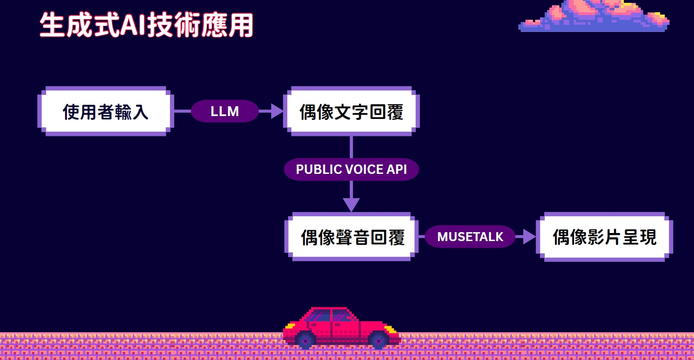
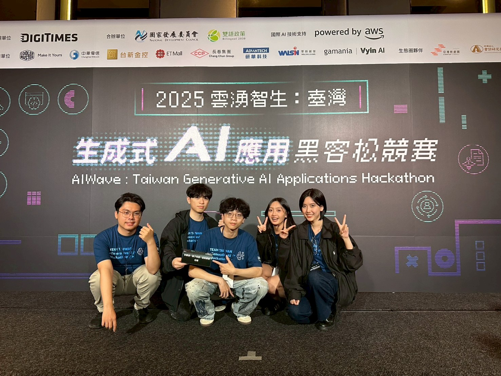

# AI-Idol-Hackathon-Showcase

🎤 A Generative AI Idol system developed during the 2025 “雲湧智生：臺灣生成式 AI 應用黑客松競賽”, hosted by DIGITIMES and AWS, with the challenge topic provided by Gamania (橘子集團).

## 📍 Competition Info

- Event: [2025 雲湧智生：臺灣生成式 AI 應用黑客松](https://www.digitimes.com.tw/seminar/generativeai_hackathon/)
- Dates: April 26–27, 2025
- Location: 台北艾麗酒店
- Team Name: `你願意一輩子和我一起做黑客松嗎`
- Team Member: 謝誠諺、梁妤帆、曾宥霓、潘柏宏、游明睿
- Challenge Topic: “AI 偶像” by Gamania

## 🧠 Project Overview

This project was created as part of a 30-hour hackathon focused on applying Generative AI technologies. The challenge was to build an **interactive AI idol** capable of responding to user prompts with synthesized speech and visual expressions.

## 🚀 Features

- 🎙 Real-time voice synthesis based on fan interaction
- 🧠 Multimodal AI pipeline with language + audio + visual
- 🎭 Character-driven responses emulating idol personalities
- ☁️ AWS-based deployment with SageMaker for inference
- 🖥 Integrated frontend for live demonstration

## 🛠 Tech Stack

| Area         | Tech Used                                                                 |
|--------------|---------------------------------------------------------------------------|
| Frontend     | React.js, Vite – Web UI for user interaction with the AI Idol             |
| Backend      | FastAPI, Node.js – API routing, session management, and real-time I/O     |
| Large Language Model (LLM) | Claude 3.7 Sonnet (via Amazon Bedrock API) – Prompt processing and response generation (`llm_server/server.py`) |
| Audio Model  | MuseTalk – Lip-sync video synthesis from audio                            |
| TTS (Voice)  | FENiX Public Voice API – Authorized voice synthesis for the AI idol (token limited to competition use) |
| Hosting / Cloud | AWS SageMaker (MuseTalk), AWS Lambda / S3 – Model deployment & file storage |
| Streaming & Utils | ffmpeg, WebSocket – Real-time audio streaming and conversion         |

## 📂 System Architecture


## 📷 Demo Screenshots


## 📦 How to Run

```bash
# Clone the repo
git clone https://github.com/yourusername/AI-Idol-Hackathon.git
cd AI-Idol-Hackathon

# Install dependencies and start services (details inside each folder)
```
## Acknowledgments
Thanks to DIGITIMES, AWS, and Gamania Vyin AI for organizing this amazing hackathon opportunity.


